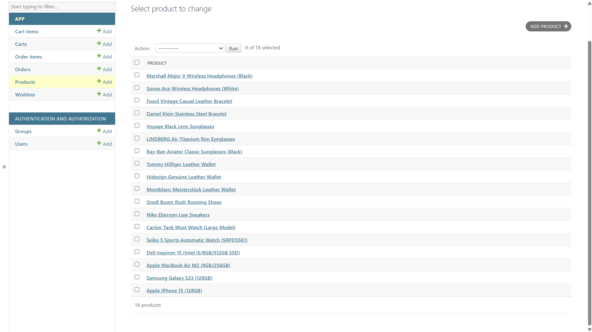
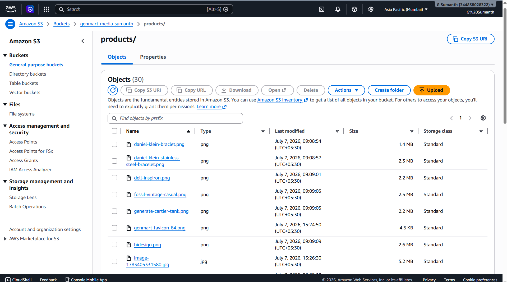

# 🛒 GenMart Backend

A Django REST Framework backend for the **GenMart E-Commerce Platform**. It provides secure JWT authentication, product management, cart, wishlist, orders, checkout APIs, email notifications, and AWS S3 media storage.

---

# 🚀 Live Demo

### Backend API

https://genmart-backend-production.up.railway.app/

### Products API

https://genmart-backend-production.up.railway.app/products/

### Django Admin

https://genmart-backend-production.up.railway.app/admin/

---

# 📸 Screenshots

## Django Admin



---

## Products API


---

## Product Images (AWS S3)



---

# ✨ Features

- User Registration
- User Login
- JWT Authentication
- Product APIs
- Wishlist APIs
- Cart APIs
- Order APIs
- Checkout
- Email Notifications
- AWS S3 Image Storage
- Django Admin Panel
- REST API
- Railway Deployment

---

# 🛠 Tech Stack

- Python
- Django
- Django REST Framework
- SQLite
- JWT
- AWS S3
- Railway
- Gunicorn
- WhiteNoise

---

# 📂 Project Structure

```
GenMart-Backend
│
├── app
├── ecommerce
├── screenshots
│   ├── admin.png
│   ├── products.png
│   └── aws-s3.png
│
├── requirements.txt
├── Procfile
├── manage.py
└── README.md
```

---

# ⚙ Installation

```bash
git clone https://github.com/YourUsername/GenMart-Backend.git

cd GenMart-Backend

python -m venv venv

venv\Scripts\activate

pip install -r requirements.txt

python manage.py migrate

python manage.py createsuperuser

python manage.py runserver
```

---

# 🔐 Environment Variables

Create a `.env`

```
SECRET_KEY=

DEBUG=True

EMAIL_HOST_USER=

EMAIL_HOST_PASSWORD=

AWS_ACCESS_KEY_ID=

AWS_SECRET_ACCESS_KEY=

AWS_STORAGE_BUCKET_NAME=

AWS_S3_REGION_NAME=
```

---

# 📦 API Endpoints

| Method | Endpoint | Description |
|---------|----------|-------------|
| POST | /register/ | Register User |
| POST | /token/ | Login |
| POST | /token/refresh/ | Refresh Token |
| GET | /products/ | Product List |
| GET | /wishlist/ | Wishlist |
| GET | /cart/ | Cart |
| POST | /checkout/ | Checkout |

---

# ☁ Deployment

Backend is deployed on **Railway**.

Images are stored securely on **AWS S3**.

---

# 👨‍💻 Author

**G Sumanth**
